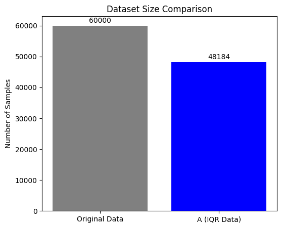
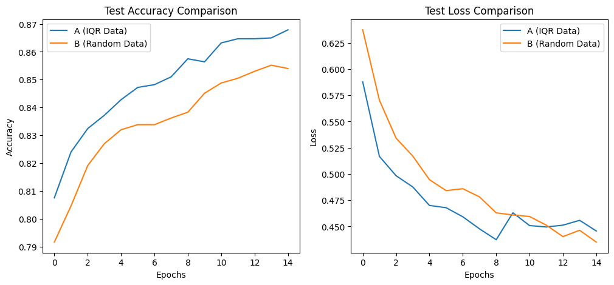

# 소형 모델 학습을 위한 IQR기반 데이터 필터링 방법
**저자: 고도영 rhehdud0@kyonggi.ac.kr**
## 1. 초록
 소형 AI 모델은 모바일과 같은 자원 제한적 환경에서 필수적이지만, 제한된 용량으로 인해 학습 데이터의 ‘질’에 큰 영향을 받는다. 본 실험은 소형 모델의 학습 효율성을 높이기 위한 데이터 필터링 전략을 제안한다. 이를 위해 Fashion-MNIST 데이터 셋을 Teacher 모델로 우선 학습시켜 샘플별 손실(Loss)을 측정했다. 이 Loss 분포에 IQR(사분위수 범위) 통계 기법을 적용하여 ‘노이즈’와 ‘단순’ 데이터로 추정하는 양극단의 이상치를 제거한 ‘필터링 데이터셋(A)’를 구축했다. 재현성이 확보된 비교 실험에서, ‘필터링 데이터셋(A)’은 이와 동일한 크기의 ‘무작위 데이터셋(B)’보다 소형 모델인 student 모델을 더 빠르고 효율적으로 학습시켰다. 최종적으로 ‘필터링 데이터셋(A)’ 모델은 더 높은 테스트 정확도(86.79% vs 85.40%)를 달성했다. 이 결과는 소형 모델의 한정된 자원을 효율적으로 활용하기 위해서는, 무작위로 수집한 데이터의 ‘질’을 높이는 데이터 필터링이 매우 유효한 전략임을 시사한다.
## 2. 서론
 최근 딥러닝 분야는 대형 모델 중심으로 발전하고 있으나, 실제 환경에선 응답속도나 컴퓨팅 파워가 문제가 되어 경량화된 소형 모델의 중요성이 여전히 크다. 소형 모델은 파라미터의 수가 적어 용량이 제한적이기 때문에, 학습 데이터의 ‘질’에 큰 영향을 받을 수 있다. 만약 소형 모델의 한정된 자원이 노이즈나 쓸모없는 데이터가 아닌 정보 밀도가 높은 데이터에 집중한다면, 학습 효율성과 최종 성능이 향상될 수 있을 것이다. 본 실험은 Loss기반 IQR 필터링을 통해 이상치 데이터를 제거하면, 소형 모델의 학습에 더 효율적인 데이터셋을 구성할 수 있다는 가설을 세웠다. 이를 검증하기 위해, Fashion-MNIST 데이터셋을 대상으로 (A) 필터링된 데이터와 (B) 동일한 크기의 무작위 데이터를 소형 CNN 모델로 각각 학습시켰다. 이 과정에서 재현성을 확보하기 위해 모든 랜덤 시드를 고정했다. 본 연구는 (A) 데이터가 (B) 데이터보다 더 빠르고 높은 정확도로 수렴함을 보임으로써, 소형 모델 학습에 있어 데이터 필터링의 유효성을 증명하고자 한다.
## 3. 실험 방법
### 3-1. 데이터셋 및 전처리
 본 실험은 Fashion-MNIST 데이터셋을 사용했다. 이는 28x28 픽셀 흑백 이미지 10종으로 구성되며, 학습 데이터 60,000장, 테스트 데이터 10,000장으로 이루어져 있다. 모든 이미지의 픽셀값을 0-255 범위에서 0-1 범위로 정규화했다. CNN 모델의 입력 형식에 맞추어 (N, 28, 28, 1)의 4D 텐서로 변환했다.  
 
**데이터 난이도 측정을 위한 ‘Teacher’모델** :
데이터 필터링의 기준이 되는 난이도 점수(Loss)를 산출하기 위해 ‘Teacher’ 모델을 우선 학습시켰다.  
**모델 구조** : Teacher 모델은 [Conv2D(32) -> Conv2D(64) -> MaxPool2D -> Dropout(0.2) -> Flatten -> Dense(128) -> Dropout(0.5) -> Dense(10, from_logits=True)] 구조로 설계되었다.  
**학습** : 전체 학습 데이터 60,000장으로 10 에포크 동안 학습시켰다. 옵티마이저는 ‘Adam’을, 손실 함수는 SparseCategoricalCrossentropy(from_logits=True)를 사용하였다.  
**Loss 기반 IQR 필터링 및 데이터셋 구축** :
Teacher 모델을 사용하여 전체 학습 데이터 60,000장에 대한 샘플별 손실을 계산했다.  
**Loss 계산** : reduction=’none’ 옵션을 사용하여 60,000개 샘플 각각의 Loss 값을 추출했다.  
**IQR 필터링** : 이 Loss값의 분포에서 Q1(25%)과 Q3(75%)값을 계산하여 IQR을 도출했다. 통계적 이상치의 경계인 [Q1 - 1.5 * IQR] (하한)과 [Q3 + 1.5 * IQR] (상한)을 정의했다.
### 3-2. 데이터셋 구축
**데이터셋 A** : Loss값이 하한과 상환 사이에 있는 데이터만으로 구성했다.  
**데이터셋 B** : ‘데이터셋 A’와 공정한 비교를 위한 대조군으로, 원본 60,000장에서 A와 동일한 개수를 무작위로 샘플링했다.  
**‘student’ 모델을 이용한 비교 실험**
두 데이터셋의 효율성을 비교하려고 일부러 경량화한 ‘student’ 모델을 사용했다.  
**모델 구조** :  [Conv2D(8) -> MaxPool2D -> Dropout(0.2) -> Flatten -> Dense(16) -> Dropout(0.5) -> Dense(10, activation=’softmax’)] 구조로 설계되었다.  
**비교 학습** : 시드를 고정한 후 두 개의 student 모델을 각각 데이터셋 A와 데이터셋 B로 15 에포크 동안 학습시켰다.
### 3-3. 실험 환경 및 재현성
본 실험의 신뢰도와 재현성을 확보하기 위해 모든 무작위 요소를 통제했다.

**실험 환경** : 구글 코랩(T4)  
**시드 고정** : Numpy, random, Tensorflow의 랜덤 시드를 모두 42로 고정했다.  
**결정론적 연산** : GPU 연산의 비결정성을 제거하기 위해 os.environ[‘TF_DETERMINISTIC_OPS’] = ‘1’ 및 tf.config.experimental.enable_op_determinism() 설정을 활성화했다.
## 4. 결과
본 실험의 핵심인 데이터 필터링 단계의 통계적 결과는 같다.
### 4-1. 필터링 적용 후 데이터셋

IQR 필터링을 적용한 결과, 원본 60,000개 중에 11,816개(약 19.7%)의 샘플이 ‘이상치’로 간주되어 제거되었다. 이에 따라 본 실험에 사용된 데이터셋 A와 데이터셋 B는 모두 48,184의 샘플로 구성되었다.
### 4-2. student 모델 학습 곡선 비교

#### 4-2-1. 테스트 정확도
데이터셋 A로 학습된 모델(파란색)은 데이터셋 B로 학습된 모델(주황색)보다 학습 전 구간에서 일관되게 더 높은 정확도를 보였다. 필터링된 데이터(A) 모델은 더 빠른 초기 학습 속도를 보였으며, 15 에포크에 도달했을 때 최종 정확도 86.79%를 기록했다. 이는 무작위 데이터(B) 모델의 최종 정확도 85.40%보다 1.39%p 높은 수치이다.

#### 4-2-2. 테스트 손실
전반적으로 필터링 데이터(A) 모델의 손실(파란색)이 무작위 데이터(B) 모델의 손실(주황색)보다 더 빠르고 낮게 수렴했다. Epoch 11에서 두 모델의 손실이 교차하는 모습이 관측되었지만, 전반적으로는 필터링 데이터(A) 모델이 더 우수했다.

## 5. 고찰
본 실험의 핵심 결과는 그림 2에서 명확히 드러나듯이, ‘IQR 필터링을 거친 데이터(A)’가 ‘무작위 데이터(B)’보다 소형 모델 학습에 더 효율적임을 보여주었다. 이는 데이터의 질이 무작위 데이터보다 소형 모델 학습에 더 중요할 것이라는 본 연구의 초기 가설을 뒷받침한다.
이러한 결과의 주된 원인은 소형 모델의 제한된 용량과 데이터의 정보 밀도 사이의 상호작용으로 해석할 수 있다. 무작위 데이터(B)에는 Teacher 모델이 식별한 이상치가 포함되어 있었다. 이 이상치는 Loss가 비정상적으로 높아 ‘노이즈’로 의심되는 데이터일 수 있다.
반면 ‘필터링 데이터(A)’는 이 데이터를 제거함으로써, 정보 밀도가 높은 데이터로만 구성된다. 소형 모델은 한정된 용량을 이 필터링된 데이터의 유의미한 패턴을 학습하는 데에만 온전히 집중할 수 있었고, 이것이 더 빠른 학습 속도와 높은 최종 정확도(일반화 성능)로 이어진 것으로 분석된다.
### 5-1. 연구의 의의
본 연구는 모바일 기기나 엣지 디바이스처럼 자원이 제한된 환경에서 소형 모델을 운용할 때, 무작위로 데이터를 수집하는 것보다, 보유한 데이터를 정제하여 데이터의 질을 높이는 것이 더 효율적이고 경제적인 전략일 수 있다.
### 5-2. 한계점 및 향후 연구
그럼에도 불구하고 본 실험은 몇 가지 한계점을 갖는다.

**한계점 1** : 본 실험은 Fashion-MNIST라는 비교적 잘 정제된 데이터셋에 한정되어 있다. 실제 환경의 데이터는 훨씬 더 많은 노이즈를 포함하고 있어, 필터링의 효과가 더 극적이거나 혹은 다르게 나타날 수 있다

**한계점 2** : IQR은 통계적으로 간단한 기법이다. 이 방식이 유의미한 어려운 데이터까지 일부 제거했을 가능성이 있다.

**향후 연구** : 향후 연구에서는 더 복잡한 데이터셋이나, 실제 환경에서 수집한 노이즈가 많은 데이터에 본 필터링 기법을 적용해 볼 필요가 있다. 또한 IQR을 사용하여 데이터를 제거하는 대신 어려운 예제를 식별하여 이들 데이터를 더 가중치를 두어 학습하는 난이도 기반 샘플링 같은 전략으로 발전시킬 수 있을 것이다.
## 6. 결론
 본 실험은 소형 CNN 모델의 학습 효율성을 향상시키기 위한 데이터 필터링의 중요성을 검증하고자 했다. Fashion-MNIST 데이터셋을 대상으로 Teacher 모델의 Loss 기반 IQR 필터링을 적용하여, 통계적 이상치를 제거한 ‘필터링 데이터셋(A)’를 구축했다. 재현성이 확보된 비교 실험을 통해, ‘필터링 데이터셋(A)’으로 학습된 소형 모델이 동일한 크기의 ‘무작위 데이터셋(B)’로 학습된 모델보다 빠른 수렴 속도, 더 낮은 손실, 그리고 더 높은 테스트 정확도를 달성함을 실험적으로 증명했다. 이 결과는 모델의 용량이 제한적인 소형 모델의 경우, 무작위 데이터를 학습하는 것보다 데이터의 질을 높이는 것이 더 효율적인 전략일 수 있음을 강력히 시사한다. 이는 특히 자원이 제한된 엣지 디바이스 환경 등에서 AI 모델을 최적화하는 데 중요한 통찰을 제공한다.
